# 🏦 Azure Banking Lakehouse

<div align="center">

### Production-Inspired Banking Data Engineering & Analytics Platform

Built using **Azure Data Factory • ADLS Gen2 • Azure Databricks • PySpark • Delta Lake • Azure Synapse Analytics • Azure Event Hubs • REST API • Databricks AI/BI**

⭐ If you find this project useful, consider giving it a star.

</div>

<div align="center">


</div>

---

# 📖 Project Overview

This project implements an end-to-end **Banking Data Lakehouse on Microsoft Azure** using the **Medallion Architecture (Bronze → Silver → Gold)**.

Banking data is ingested from multiple sources including batch CSV files, REST APIs, and streaming transaction events.

The platform uses **Azure Data Factory** for orchestration, **ADLS Gen2** for data lake storage, **Azure Databricks and PySpark** for data transformation, **Azure Synapse Analytics** for SQL analytics, and **Databricks AI/BI** for business dashboards.

---

# 🎯 Project Objectives

- Build an end-to-end Azure Data Engineering platform
- Implement the Bronze → Silver → Gold Medallion Architecture
- Ingest banking data from batch files, REST APIs, and streaming events
- Store raw and processed data in ADLS Gen2
- Perform scalable transformations using PySpark
- Implement data quality and validation
- Process transaction events using Azure Event Hubs
- Orchestrate workflows using Azure Data Factory
- Create business-ready Gold datasets
- Expose analytical data through Synapse SQL views
- Build interactive dashboards using Databricks AI/BI
- Implement Unity Catalog, Managed Identity, and Azure RBAC
- Maintain the platform using Git and GitHub

---

# ✨ Features

## Data Engineering

- End-to-End ETL Pipelines
- Batch CSV Ingestion
- REST API Ingestion
- Streaming Transaction Processing
- Distributed Processing using PySpark
- Medallion Architecture
- Delta Lake

## Data Lake

- ADLS Gen2
- Bronze Layer
- Silver Layer
- Gold Layer
- Raw and Processed Data Separation

## Data Processing

- Schema Enforcement
- Data Cleaning
- Data Standardization
- Duplicate Handling
- Data Validation
- Business Transformations
- Data Quality Checks

## Analytics

- Gold Analytical Datasets
- Azure Synapse SQL Views
- Databricks AI/BI Dashboards
- Transaction Analytics
- Customer 360
- Banking KPI Analytics
- Fraud Analytics

## Orchestration

- Azure Data Factory
- API → Bronze Pipeline
- Batch → Bronze Pipeline
- Bronze → Silver Pipeline
- Silver → Gold Pipeline

## Security & Governance

- Unity Catalog
- Managed Identity
- Azure RBAC
- Storage Credentials
- External Locations

---

# 🌟 Project Highlights

- 🏦 Banking-focused Azure Lakehouse
- ☁️ Microsoft Azure cloud architecture
- 🔄 Batch + REST API + Streaming ingestion
- 🥉 Bronze → Silver → Gold architecture
- ⚡ PySpark distributed data processing
- 🧹 Data quality and validation
- 📊 Business-ready Gold datasets
- 🔧 Azure Data Factory orchestration
- 🗃️ Azure Synapse Analytics
- 📈 Databricks AI/BI dashboards
- 🔐 Unity Catalog and Managed Identity
- 📁 Git-integrated Azure Data Factory artifacts
- 📸 End-to-end implementation screenshots
- 🧪 Synthetic banking datasets

---

# 🏗️ Architecture

```text
                         ┌─────────────────────────┐
                         │      DATA SOURCES       │
                         ├─────────────────────────┤
                         │ CSV Batch Files         │
                         │ REST APIs               │
                         │ Event Hubs              │
                         └────────────┬────────────┘
                                      │
                                      ▼
                         ┌─────────────────────────┐
                         │   Azure Data Factory     │
                         │      Orchestration       │
                         └────────────┬────────────┘
                                      │
                                      ▼
                         ┌─────────────────────────┐
                         │       ADLS Gen2          │
                         │      Bronze Layer        │
                         └────────────┬────────────┘
                                      │
                                      ▼
                         ┌─────────────────────────┐
                         │    Azure Databricks      │
                         │        PySpark           │
                         │   Data Quality / ETL     │
                         └────────────┬────────────┘
                                      │
                                      ▼
                         ┌─────────────────────────┐
                         │       Silver Layer       │
                         │   Cleaned / Validated    │
                         └────────────┬────────────┘
                                      │
                                      ▼
                         ┌─────────────────────────┐
                         │        Gold Layer        │
                         │   Business Analytics     │
                         └────────────┬────────────┘
                                      │
                         ┌────────────┴────────────┐
                         ▼                         ▼
                ┌──────────────────┐      ┌──────────────────┐
                │ Azure Synapse    │      │ Databricks AI/BI │
                │ SQL Views        │      │ Dashboards       │
                └──────────────────┘      └──────────────────┘
```

---

# 📊 Medallion Architecture

The project follows the **Medallion Architecture** to separate raw ingestion, data quality processing, and business analytics.

## 🥉 Bronze Layer

Purpose:

- Store raw ingested data
- Preserve source data
- Maintain historical data
- Minimize business transformations

Sources include:

- Account
- Branch
- Customer
- Fixed Deposit
- Loan
- Transaction
- REST API data
- Streaming transaction data

---

## 🥈 Silver Layer

Purpose:

- Clean and validate data
- Standardize schemas
- Remove duplicates
- Apply business rules
- Prepare trusted data for analytics

### Customer Data Quality

```text
Bronze Records
     100,000
        │
        ▼
Data Quality Processing
        │
        ▼
Silver Records
      96,792
        │
        ▼
Records Removed
       3,208
```

---

## 🥇 Gold Layer

Purpose:

- Business-ready datasets
- Analytics optimization
- Reporting
- KPI analysis
- Customer 360
- Transaction and fraud analytics

Gold datasets include:

- `customer_360`
- `transaction_summary`
- `banking_kpi_summary`
- `account_summary`

---

# 📂 Project Structure

```text
azure-banking-lakehouse/
│
├── api/
│   ├── main.py
│   └── requirements.txt
│
├── databricks/
│   ├── bronze_streaming/
│   │
│   ├── dashboards/
│   │   └── Banking Lakehouse Analytics.lvdash.json
│   │
│   ├── gold/
│   │   ├── account_summary.ipynb
│   │   ├── banking_kpi_summary.ipynb
│   │   ├── customer_360.ipynb
│   │   └── transaction_fraud_analytics.ipynb
│   │
│   └── silver/
│       ├── account_bronze_to_silver.ipynb
│       ├── branch_bronze_to_silver.ipynb
│       ├── customer_bronze_to_silver.ipynb
│       ├── fd_bronze_to_silver.ipynb
│       ├── loan_bronze_to_silver.ipynb
│       └── transaction_bronze_to_silver.ipynb
│
├── dataset/
│
├── docs/
│   └── screenshots/
│
├── factory/
│
├── linkedService/
│
├── pipeline/
│
├── streaming/
│   └── transaction_producer.py
│
├── synapse/
│   └── views/
│
├── README.md
└── publish_config.json
```

---

# ⚙️ Technology Stack

| Category | Technology |
|---|---|
| Cloud Platform | Microsoft Azure |
| Data Lake | Azure Data Lake Storage Gen2 |
| Orchestration | Azure Data Factory |
| Data Processing | Azure Databricks |
| Programming | Python / PySpark |
| Storage Format | Delta Lake |
| Streaming | Azure Event Hubs |
| API Integration | REST API |
| Analytics | Azure Synapse Analytics |
| BI | Databricks AI/BI |
| Governance | Unity Catalog |
| Identity | Managed Identity / Azure RBAC |
| Version Control | Git & GitHub |

---

# 🔄 End-to-End Pipeline Flow

```text
CSV Files ────────────────┐
                          │
REST APIs ────────────────┼──► Azure Data Factory
                          │             │
Event Hubs ───────────────┘             ▼
                                  ADLS Gen2
                                      │
                                      ▼
                                   Bronze
                                      │
                                      ▼
                               Azure Databricks
                                   PySpark
                                      │
                                      ▼
                                   Silver
                                      │
                                      ▼
                                    Gold
                                  /       \
                                 /         \
                                ▼           ▼
                         Azure Synapse    Databricks
                          SQL Views         AI/BI
```

---

# 🔧 Azure Data Factory

Azure Data Factory is responsible for ingestion and orchestration.

## Main Pipelines

```text
pl_api_banking_raw_to_bronze
pl_batch_banking_raw_to_bronze
pl_bronze_to_silver
pl_gold_banking_transformations
```

## API → Bronze

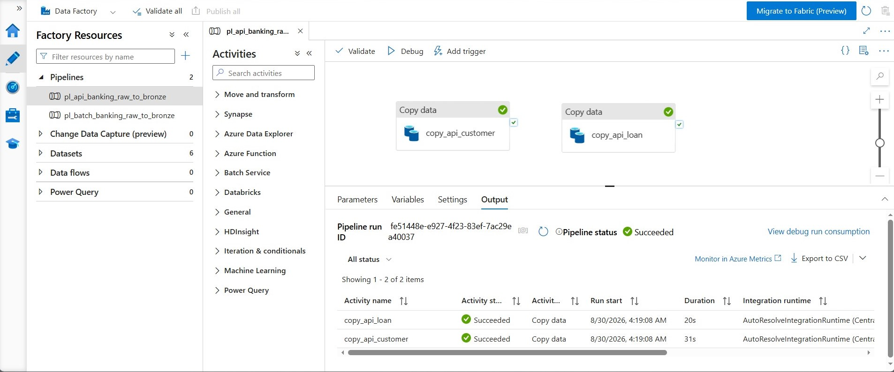

## Batch → Bronze

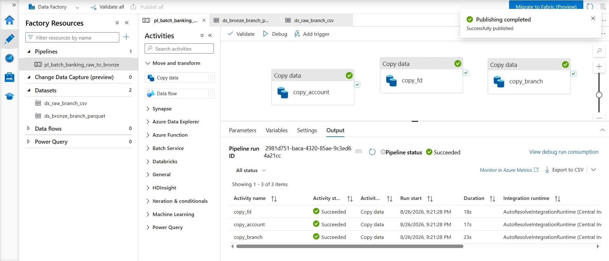

## Bronze → Silver

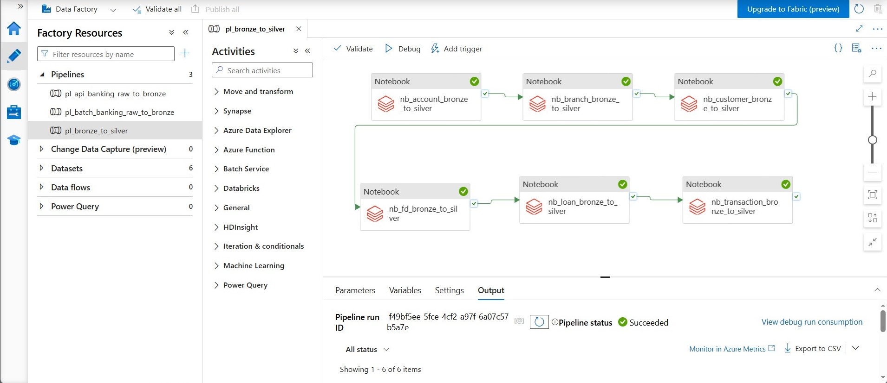

## Silver → Gold

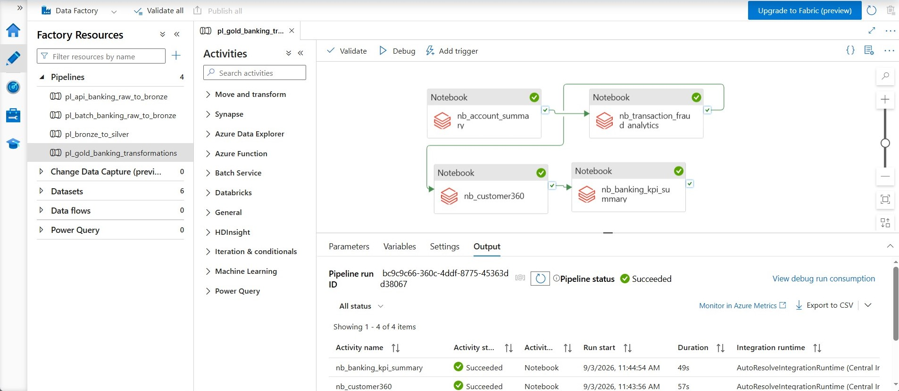

[View ADF Pipelines](pipeline/)

---

# 🌐 REST API Ingestion

Customer and Loan data are ingested through REST API endpoints and orchestrated using Azure Data Factory.

```text
REST API
   │
   ▼
Azure Data Factory
   │
   ▼
ADLS Gen2
   │
   ▼
Bronze Layer
```

### API / Swagger

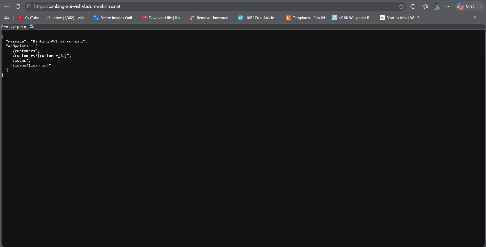

[Open API Screenshot](docs/screenshots/08_api_swagger.jpg)

---

# ⚡ Streaming Transaction Pipeline

Transaction data was tested using **Azure Event Hubs** and Databricks Structured Streaming.

```text
Transaction Producer
        │
        ▼
Azure Event Hubs
        │
        ▼
Databricks Structured Streaming
        │
        ▼
ADLS / Delta
        │
        ▼
Silver
        │
        ▼
Gold
```

The streaming test processed **100,000 transaction events**.

### Streaming Screenshots

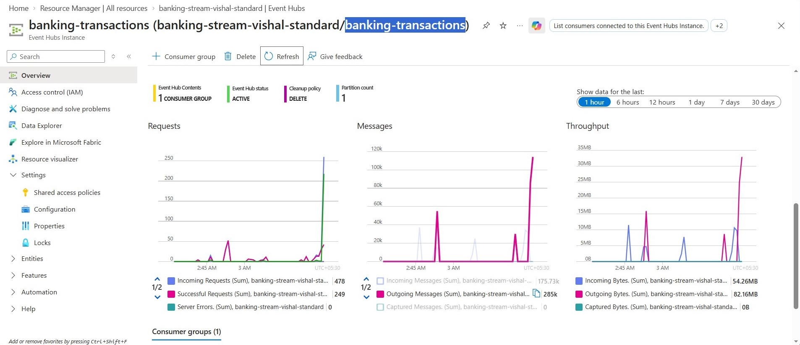

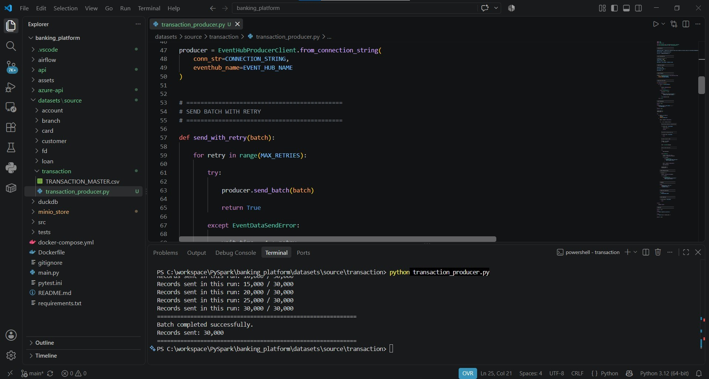

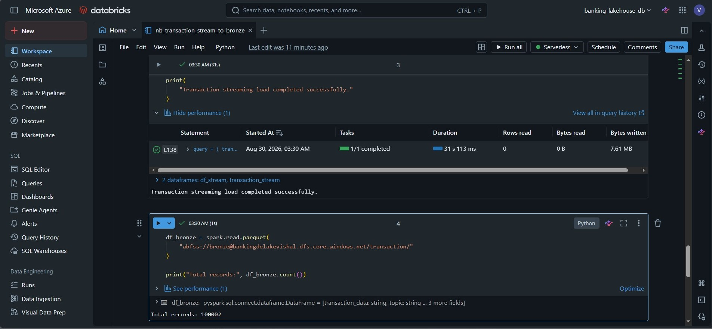

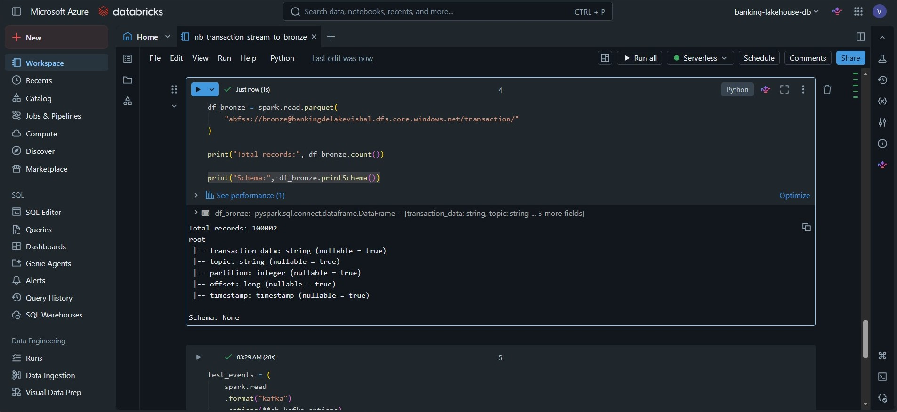

[View Streaming Producer](streaming/transaction_producer.py)

---

# 🧠 Azure Databricks

Azure Databricks is used for PySpark-based Silver and Gold transformations.

## Silver Notebooks

- `account_bronze_to_silver`
- `branch_bronze_to_silver`
- `customer_bronze_to_silver`
- `fd_bronze_to_silver`
- `loan_bronze_to_silver`
- `transaction_bronze_to_silver`

## Gold Notebooks

- `account_summary`
- `banking_kpi_summary`
- `customer_360`
- `transaction_fraud_analytics`

### Bronze → Silver

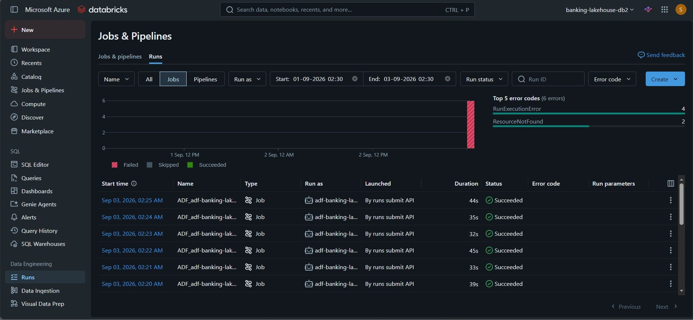

### Silver → Gold

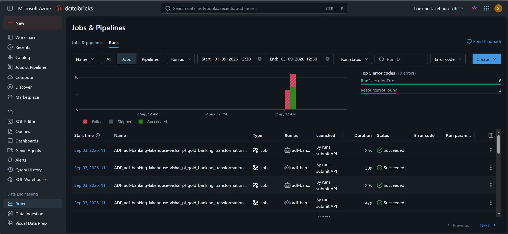

[View Silver Notebooks](databricks/silver/)

[View Gold Notebooks](databricks/gold/)

---

# 📊 Databricks AI/BI Dashboard

The Gold layer powers a **Databricks AI/BI dashboard** for business analytics.

## Dashboard Includes

- Transaction Trends
- Credit vs Debit Analysis
- Transaction Channel Analysis
- Customer Risk Categories
- Account Type Distribution
- Banking KPIs

## Dashboard Preview


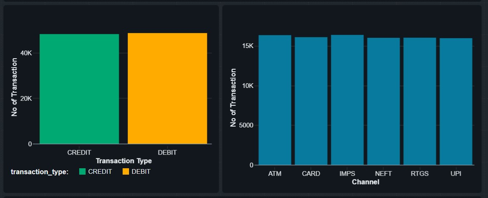

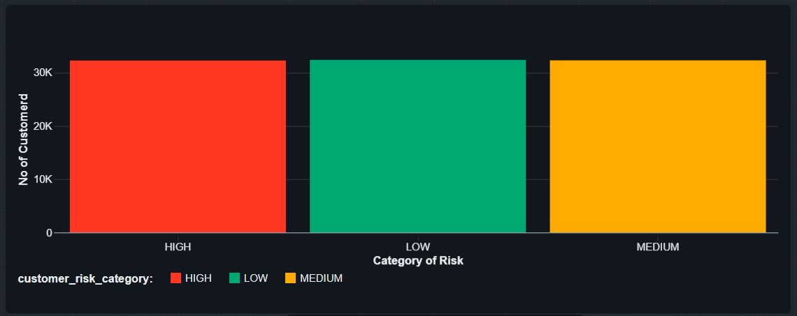

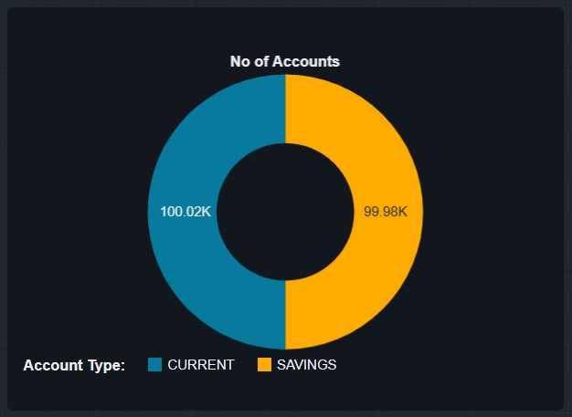

### Dashboard Definition

[📊 Open Banking Lakehouse Analytics Dashboard](databricks/dashboards/Banking%20Lakehouse%20Analytics.lvdash.json)

### Dashboard Folder

[📁 View Databricks Dashboards](databricks/dashboards/)

---

# 🗃️ Azure Synapse Analytics

Azure Synapse provides the SQL analytics layer over the Gold datasets.

## Analytical Views

```text
vw_account_summary.sql
vw_banking_kpi.sql
vw_customer_360.sql
vw_transaction_fraud.sql
```

### Synapse / ADLS

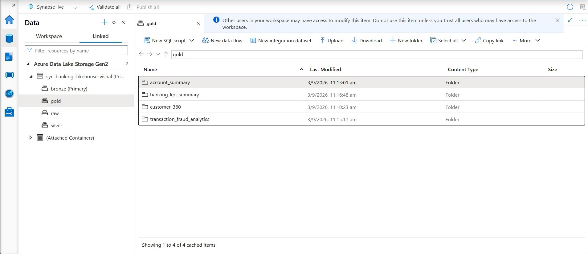

[View Synapse SQL Views](synapse/views/)

---

# 🗄️ ADLS Gen2

ADLS Gen2 acts as the central storage layer for the lakehouse.

```text
ADLS Gen2
│
├── Bronze
│   ├── Account
│   ├── Branch
│   ├── Customer
│   ├── FD
│   ├── Loan
│   └── Transaction
│
├── Silver
│   └── Validated Delta Data
│
└── Gold
    └── Business-ready Analytics
```

### ADLS Structure

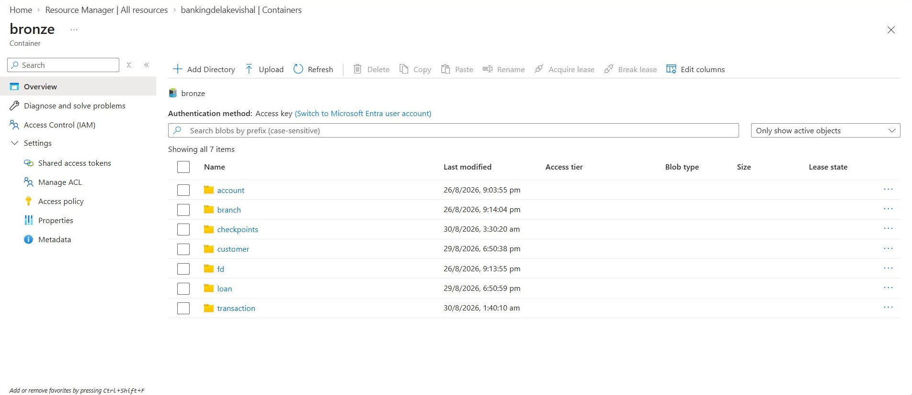

---

# 🔐 Security & Governance

The platform uses Azure-native security and governance capabilities.

- Azure Managed Identity
- Azure RBAC
- Databricks Unity Catalog
- Storage Credentials
- External Locations
- Git-based configuration

No production credentials, passwords, access keys, or Event Hubs connection strings are stored in the repository.

---

# 📸 Project Screenshots

## Azure Data Factory


## Azure Databricks


## ADLS Gen2


## REST API


## Event Hubs


## Streaming


## Azure Synapse


## Databricks AI/BI


---

# 🔗 Project Resources

| Component | Link |
|---|---|
| Databricks Silver | [View Notebooks](databricks/silver/) |
| Databricks Gold | [View Notebooks](databricks/gold/) |
| Databricks AI/BI | [View Dashboard](databricks/dashboards/Banking%20Lakehouse%20Analytics.lvdash.json) |
| ADF Pipelines | [View Pipelines](pipeline/) |
| ADF Datasets | [View Datasets](dataset/) |
| ADF Linked Services | [View Linked Services](linkedService/) |
| Synapse Views | [View SQL Views](synapse/views/) |
| Streaming | [View Producer](streaming/transaction_producer.py) |
| Screenshots | [View Screenshots](docs/screenshots/) |

---

# 📊 Data Quality

The platform applies data quality checks before data reaches the analytical Gold layer.

### Customer Example

```text
Bronze
100,000 records
      │
      ▼
Validation & Cleaning
      │
      ├──────────────► Invalid / Removed
      │
      ▼
Silver
96,792 records
```

Validation includes:

- Null handling
- Duplicate detection
- Schema validation
- Data type validation
- Business-rule validation
- Standardization

---

# 🎯 What This Project Demonstrates

This project demonstrates a complete modern Azure Data Engineering workflow:

```text
Ingestion
    ↓
Orchestration
    ↓
ADLS Gen2
    ↓
Bronze
    ↓
PySpark Processing
    ↓
Data Quality
    ↓
Silver
    ↓
Gold
    ↓
┌─────────────────────┐
│                     │
▼                     ▼
Azure Synapse     Databricks AI/BI
SQL Analytics       Dashboards
```

### Core Skills Demonstrated

- Azure Data Engineering
- Data Lakehouse Architecture
- Batch Processing
- REST API Integration
- Streaming Data Engineering
- PySpark
- Delta Lake
- Data Quality
- Azure Data Factory
- Azure Synapse Analytics
- Databricks AI/BI
- Unity Catalog
- Managed Identity
- Azure RBAC
- Git and GitHub

---

# 🔐 Data Disclaimer

This project is created for **learning, portfolio, and demonstration purposes**.

- All banking data is synthetic.
- No real customer financial data is used.
- Raw banking datasets are not included in the public repository.
- Credentials, passwords, access keys, and connection strings should never be committed.
- Azure resources may need to be recreated in your own subscription.
- Event Hubs was used as a temporary streaming test resource.

---

# 👨‍💻 Author

## Vishal Soma

**Azure Data Engineer**

Azure Data Factory • ADLS Gen2 • Databricks • PySpark • Synapse • Data Lakehouse

GitHub:

https://github.com/VishalSoma2229

---

<div align="center">

### ⭐ If you like this project, please give it a Star!

**Azure Data Engineering • Lakehouse • PySpark • Databricks • Data Factory • Synapse**

Thank you for visiting this repository. 🚀

</div>
