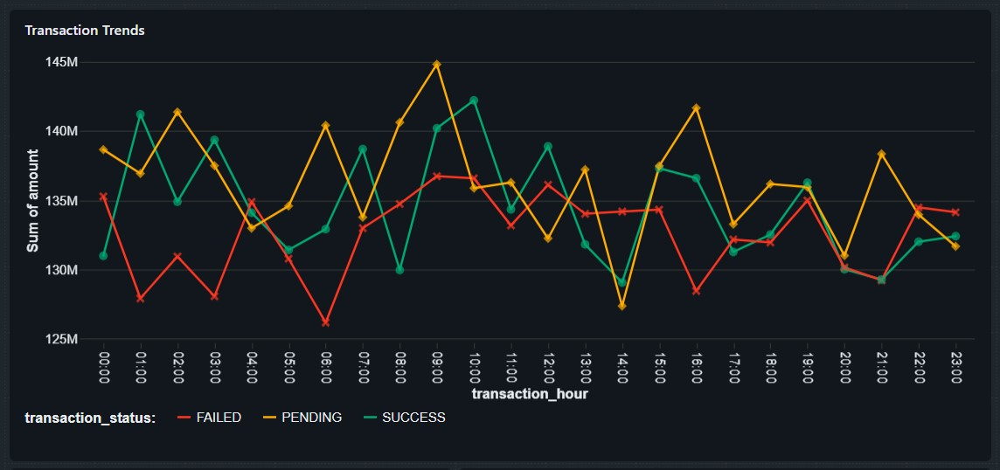

# 🏦 Azure Banking Lakehouse

<p align="center">
  <b>End-to-End Azure Banking Data Engineering & Analytics Platform</b>
</p>

<p align="center">
  
  
  
  
  
  
</p>

---

## 📌 Project Overview

The **Azure Banking Lakehouse** is an end-to-end cloud data engineering project built on Microsoft Azure.

The platform demonstrates how banking data from multiple sources can be ingested, stored, transformed, governed, and analyzed using modern Azure data engineering services.

The solution follows a **Medallion Architecture** with **Bronze, Silver, and Gold** layers and combines batch ingestion, REST API ingestion, and event-stream processing.

---

## 🎯 Objectives

- Build an end-to-end banking data lakehouse on Azure
- Ingest data from CSV files, REST APIs, and streaming events
- Store raw and processed data in Azure Data Lake Storage Gen2
- Implement Bronze, Silver, and Gold data layers
- Perform data cleansing and transformation using PySpark
- Implement data quality checks
- Orchestrate pipelines using Azure Data Factory
- Use Unity Catalog for Databricks governance
- Build analytical datasets for banking use cases
- Create an interactive Databricks AI/BI dashboard
- Demonstrate real-world cloud data engineering practices

---

## 🚀 Key Features

- ✅ Azure Data Lake Storage Gen2
- ✅ Azure Data Factory orchestration
- ✅ CSV batch ingestion
- ✅ REST API ingestion
- ✅ Azure Event Hubs streaming implementation
- ✅ Azure Databricks with PySpark
- ✅ Delta Lake architecture
- ✅ Bronze → Silver → Gold transformations
- ✅ Data quality and cleansing
- ✅ Unity Catalog governance
- ✅ Azure Synapse analytical views
- ✅ Databricks AI/BI dashboard
- ✅ Managed Identity authentication
- ✅ GitHub-based project organization

---

## 🏗️ Architecture

```text
                    ┌──────────────────────┐
                    │     Data Sources     │
                    ├──────────────────────┤
                    │ CSV Files             │
                    │ REST APIs             │
                    │ Event Hub Events       │
                    └──────────┬───────────┘
                               │
                               ▼
                    ┌──────────────────────┐
                    │ Azure Data Factory   │
                    │ Ingestion &          │
                    │ Orchestration        │
                    └──────────┬───────────┘
                               │
                               ▼
              ┌─────────────────────────────────┐
              │      ADLS Gen2 - BRONZE         │
              │        Raw Banking Data         │
              └────────────────┬────────────────┘
                               │
                               ▼
                    ┌──────────────────────┐
                    │ Azure Databricks     │
                    │ PySpark              │
                    │ Data Quality          │
                    │ Transformations       │
                    └──────────┬───────────┘
                               │
                               ▼
              ┌─────────────────────────────────┐
              │       ADLS Gen2 - SILVER        │
              │ Cleaned & Validated Data        │
              └────────────────┬────────────────┘
                               │
                               ▼
                    ┌──────────────────────┐
                    │ Azure Databricks     │
                    │ Gold Transformations │
                    └──────────┬───────────┘
                               │
                               ▼
              ┌─────────────────────────────────┐
              │        ADLS Gen2 - GOLD         │
              │   Business-Ready Datasets      │
              └───────────────┬─────────────────┘
                              │
                 ┌────────────┴────────────┐
                 ▼                         ▼
       ┌──────────────────┐       ┌────────────────────┐
       │ Azure Synapse    │       │ Databricks AI/BI   │
       │ Analytical Views │       │ Dashboard          │
       └──────────────────┘       └────────────────────┘
```

---

## 🥉🥈🥇 Medallion Architecture

### 🥉 Bronze Layer

Stores raw data with minimal transformation.

Sources include:

- Account
- Branch
- Customer
- FD
- Loan
- Transaction

### 🥈 Silver Layer

The Silver layer contains cleaned and validated banking data.

Transformations include:

- Null handling
- Duplicate handling
- Data type standardization
- Data validation
- Invalid record removal
- Business-rule validation

Silver notebooks are located in:

```text
databricks/silver/
```

### 🥇 Gold Layer

The Gold layer contains business-ready analytical datasets.

### Gold datasets

- `customer_360`
- `transaction_summary`
- `banking_kpi_summary`
- `account_summary`

Gold notebooks are located in:

```text
databricks/gold/
```

---

## 📂 Project Structure

```text
azure-banking-lakehouse/
│
├── api/
│   ├── main.py
│   └── requirements.txt
│
├── databricks/
│   ├── bronze_streaming/
│   ├── dashboards/
│   │   └── Banking Lakehouse Analytics.lvdash.json
│   ├── gold/
│   │   ├── account_summary.ipynb
│   │   ├── banking_kpi_summary.ipynb
│   │   ├── customer_360.ipynb
│   │   └── transaction_fraud_analytics.ipynb
│   └── silver/
│       ├── account_bronze_to_silver.ipynb
│       ├── branch_bronze_to_silver.ipynb
│       ├── customer_bronze_to_silver.ipynb
│       ├── fd_bronze_to_silver.ipynb
│       ├── loan_bronze_to_silver.ipynb
│       └── transaction_bronze_to_silver.ipynb
│
├── dataset/
├── docs/
│   └── screenshots/
├── factory/
├── linkedService/
├── pipeline/
│
├── streaming/
│   └── transaction_producer.py
│
├── synapse/
│   └── views/
│       ├── vw_account_summary.sql
│       ├── vw_banking_kpi.sql
│       ├── vw_customer_360.sql
│       └── vw_transaction_fraud.sql
│
├── README.md
└── publish_config.json
```

---

## 🛠️ Technology Stack

| Technology | Purpose |
|---|---|
| **Azure Data Lake Storage Gen2** | Central cloud data lake |
| **Azure Data Factory** | Data ingestion and orchestration |
| **Azure Databricks** | PySpark transformations |
| **Delta Lake** | Reliable lakehouse storage |
| **Azure Event Hubs** | Transaction streaming implementation |
| **Azure Synapse Analytics** | Analytical SQL views |
| **Unity Catalog** | Databricks governance |
| **REST API** | Customer and Loan ingestion |
| **GitHub** | Source control |

---

## 🔄 End-to-End Data Flow

### 1. Batch Ingestion

CSV datasets are ingested through Azure Data Factory into the Bronze layer.

```text
CSV
 ↓
Azure Data Factory
 ↓
ADLS Gen2 Bronze
```

### 2. REST API Ingestion

Customer and Loan data are retrieved through REST API endpoints and loaded into Bronze.

```text
REST API
 ↓
Azure Data Factory
 ↓
ADLS Gen2 Bronze
```

### 3. Streaming Ingestion

Transaction events were produced and processed through Azure Event Hubs as part of the streaming implementation.

```text
Transaction Producer
 ↓
Azure Event Hubs
 ↓
Databricks Streaming
 ↓
ADLS Gen2
```

The Event Hubs resource was used for the streaming implementation/test and is not required to remain deployed.

### 4. Bronze → Silver

Databricks PySpark notebooks clean and validate the Bronze datasets.

```text
Bronze
 ↓
PySpark
 ↓
Data Quality
 ↓
Silver
```

### 5. Silver → Gold

Business transformations create analytical datasets.

```text
Silver
 ↓
PySpark
 ↓
Gold Datasets
```

### 6. Analytics

Gold datasets are exposed through Synapse analytical views and visualized using Databricks AI/BI dashboards.

---

## 📊 Data Quality

Data quality checks were implemented during Silver transformations.

Example results:

| Dataset | Bronze Records | Silver Records |
|---|---:|---:|
| Customer | 100,000 | 96,792 |
| Transaction | 100,002 | 100,000 |

The Customer transformation removed invalid records identified during validation.

The Transaction transformation processed 100,000 valid transaction records from the streaming test.

---

## 📈 Analytics

The Gold layer supports banking analytics such as:

- Customer 360 analysis
- Account summaries
- Transaction analytics
- Banking KPI analysis
- Transaction/fraud-oriented analytics
- Customer risk analysis
- Transaction channel analysis
- Account type analysis

---

## 📊 Databricks AI/BI Dashboard

The project includes an interactive **Databricks AI/BI dashboard** built from the Gold datasets.

Dashboard analysis includes:

- Transaction trends
- Credit vs Debit transactions
- Transaction channel distribution
- Customer risk categories
- Account type distribution
- Banking KPIs

Dashboard definition:

```text
databricks/dashboards/
└── Banking Lakehouse Analytics.lvdash.json
```

---

## 🖼️ Project Screenshots

### Azure Data Factory


### Azure Databricks


### Azure Data Lake Storage


### REST API


### Event Streaming


### Azure Synapse


### Databricks AI/BI Dashboard




---

## 🔐 Security & Governance

The project follows Azure-native security practices.

- Managed Identity authentication is used for Azure service integration where applicable.
- Databricks access is configured using Azure identity-based authentication.
- Unity Catalog is used for Databricks governance.
- Azure RBAC controls access to Azure resources.
- No real customer or banking data is used.
- Secrets and credentials are not stored in the GitHub repository.
- Streaming connection strings are kept outside the source code through environment-based configuration.

---

## 📌 Project Highlights

This project demonstrates practical experience with:

- Cloud data lake architecture
- Azure Data Factory
- ADLS Gen2
- Databricks and PySpark
- Delta Lake
- Batch data engineering
- REST API ingestion
- Event-driven streaming
- Data quality engineering
- Medallion architecture
- Data governance
- Analytical data modeling
- Synapse SQL
- Databricks AI/BI dashboards
- Git-based project organization

---

## ⚠️ Disclaimer

This project uses **synthetic banking data** created for learning and portfolio demonstration purposes.

No real customer, financial, authentication, or personally identifiable banking information is used.

---

## 👤 Author

**Vishal Soma**

Azure Data Engineering Portfolio Project

---

<p align="center">
  ⭐ If you find this project useful, consider starring the repository!
</p>
